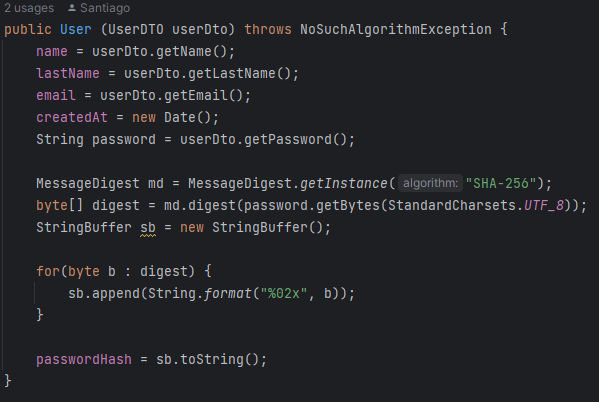

### Escuela Colombiana de Ingeniería

### Arquitecturas Empresariales


#### TALLER 7: APLICACIÓN DISTRIBUIDA SEGURA EN TODOS SUS FRENTES

#### Santiago Arévalo Rojas

### Instrucciones para ejecución
Para ejecutar la aplicación necesitamos de una instancia EC2 que tenga instalado el Java JDK, con mínimo java 8, Git y Maven.

1. Nos conectamos a una instancia EC2 que ya hayamos creado previamente, para eso lo hacemos por medio del protocolo ssh y con nuestra llave privada, en mi caso el comando luce:  
   ```ssh -i "dockerprimerweb.pem" ec2-user@ec2-3-81-96-95.compute-1.amazonaws.com```  
2. Una vez dentro encontramos nuestra máquina virtual:  
      
3. Ahora procedemos a clonar el repositorio, el cual es [https://github.com/santiarojas18/Lab7AREP.git](https://github.com/santiarojas18/Lab7AREP.git)  
4. Una vez clonado ingresamos al repositorio y lo compilamos por medio de mvn con el comnado:  
    ```mvn clean package```
5. Además, debemos de hacer la misma conexión a la instancia EC2 desde otra consola de nuestra máquina física, esto con el fin de poder correr dos máquinas virtuales de java para que se comuniquen entre sí.
6. Con las dos conexiones ssh al tiempo procedemos a correr en la primera la clase UserController, que corre por el puerto 5000, con el comando:  
    ```java -cp "target/classes:target/dependency/*" edu.escuelaing.arem.ASE.app.UserController```  
    Acá podemos evidenciar entonces en nuestra primera terminal corriendo la primera Java Virtual Machine que expone los servicios del UserController:  
      
7. Por otra parte, en nuestra segunda consola de la misma instancia EC2 corremos nuestra segunda JVM, con el comando:  
    ```java -cp "target/classes:target/dependency/*" edu.escuelaing.arem.ASE.app.FacadeServices```  
    Esta va a ser la clase fachada a la cual los usuarios se van a conectar y está corriendo por el puerto 4567:  
      
8. Finalmente, los usuarios ya se pueden conectar a nuestra aplicación por medio del DNS de nuestra instancia EC2, en mi caso [https://ec2-54-175-209-230.compute-1.amazonaws.com:4567/index.html](https://ec2-54-175-209-230.compute-1.amazonaws.com:4567/index.html), y al entrar encontramos un inicio de sesión, algo a tener en cuenta es que se realiza por medio del protocolo HTTPS debido a que realizamos la implementación de los certificados:  
      
9. Procedemos a inicar sesión con las credenciales "santiar18@hotmail.com" y "Santi123":  
      
10. Le damos click al botón de Login, en donde si se ingresaron las credenciales correctas nos enviará a la página de inicio de sesión exitoso:  
      
11. Ya dentro podemos ver todos los usuarios registrados haciendo click al botón "All the users", y podemos evidenciar que efectivamente la contraseña de los usuarios es guardada por su hash y no en limpio para asegurar la seguridad de los datos:  
      
12. También es posible preguntar por un usuario específico por medio de su email, en este caso preguntaremos por "julieta12@hotmail.com", ingresando el email en el input y dando click al botón de search:  
      
13. Así mismo, podemos cerrar sesión usando el botón de logout que nos regresa a la página de inicio:  
      
14. Si se llegara a ingresar una contraseña incorrecta, la página muestra un mensaje de error:  
      

### Información del diseño

* La arquitectura implementada fue la siguiente, propuesta en el laboratorio:  
      
* Para esto se crearon dos servidores backend, el primero es UserController (Puerto 5000), en donde se tiene toda la lógica y los servicios expuestos para la administración de usuarios, el segundo servidor es el fachada, llamado FacadeService, al cual se conectan los clientes al puerto 4567, este servidor fachada expone los archivos estáticos, estos archivos estáticos hacen todas las peticiones a este mismo servidor pero este redirige al primero mencionado.  
* La conexión que se realiza entre el servidor FacadeServices y UserController se hace por medio de la clase SecureURLReader.  
* Con el fin de mantener segura nuestra aplicación hicimos uso del protocolo HTTPS, que como es conocido debe utilizar certificados firmados, estos certificados fueron realizados por nosotros mismos y se encuentran en la carpeta "certificados".  
* Para cada clase que expone un servicio se creó un certificado y se agregó de la siguiente forma, indicando el keyStore junto con su contraseña, en este caso para el FacadeServices:  
      
* En el caso del UserController:  
      
* Ahora, en la clase para realizar la conexión entre ambas ya mencionadas se debe de indicar el TrustStore, a diferencia de las anteriores, pues en esta se encuentra en que certificados se puede confiar y allí tenemos lo dos de los servicios anteriores:  
      
* Además, para los Usuarios se creó una clase que imita una Base de datos, llamada UserDB, que ofrece los servicios para la persistencia.  
* Para crear los Usuarios tenemos dos clases, la primera es un UserDTO que recibe la información del usuario en limpio y que se envía por parámetro al creador de la clase User que se encarga de encriptar la contraseña por medio del algoritmo SHA256 y este usuario es el que se guarda en la base de datos:  
      
* Finalmente, en el UserController, para la verificación de credenciales, se encripta por medio del mismo algoritmo y se compara con el Hash guardado en la base de datos de la siguiente forma:  
      

### Video funcionamiento 

En el siguiente [video](img/LAB7Video.mp4)